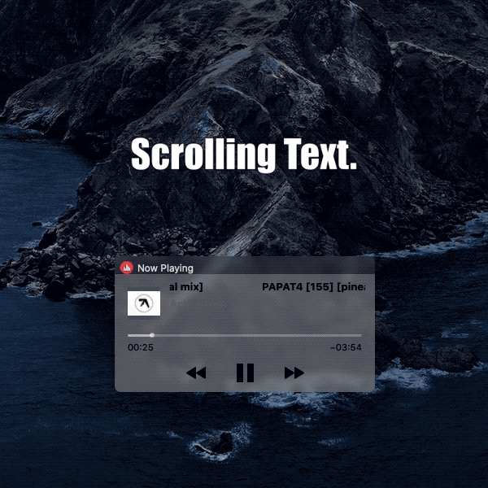

# ColorTracks
MacForge plugin that adds color to Apples Now Playing Widget.
 
 

# Information:

- Designed for macOS 10.14+
- Mainly designed to be used with [Todeska](https://github.com/jslegendre)
- ColorTracks is a [MacForge](https://github.com/w0lfschild/MacForge) plugin that adds some features to Apples Now Playing Widget.
    - Color match controls to albumn art
    - Color match backgorund to aldumn art
    - Scrolling track titles
- Author: [w0lfschild](https://github.com/w0lfschild)

# Installation:

1. Download [MacForge](https://github.com/w0lfschild/app_updates/raw/master/MacForge/MacForge.zip)
2. Install [ColorTracks](https://www.macenhance.com/mflink?macforge://github.com/w0lfschild/myRepo/raw/master/mytweaks/com.macenhance.ColorTracks)
